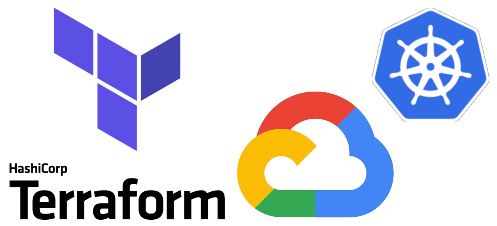
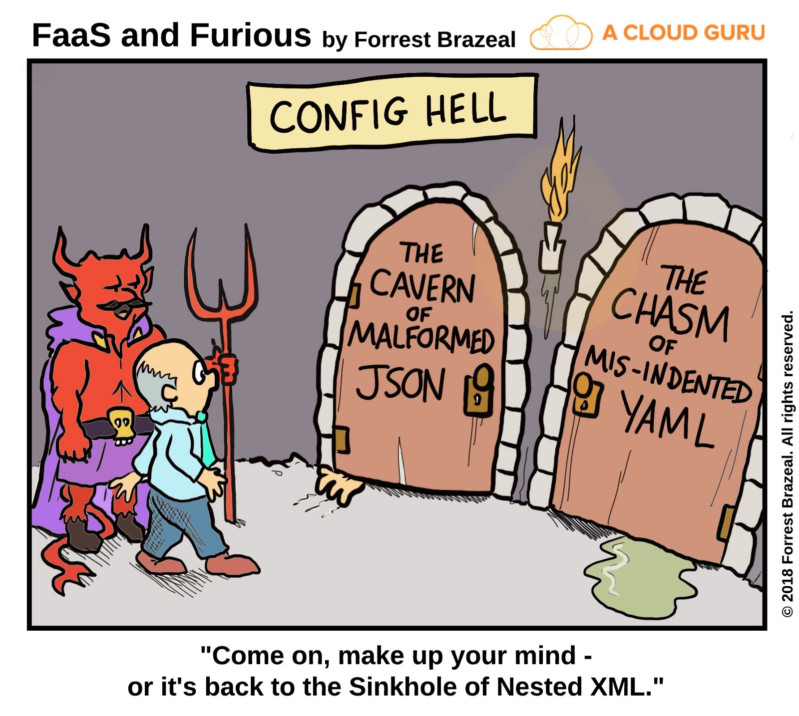

name: GCP-Terraform-Vault-Workshop
class: center,middle,title-slide
count: false

.titletext[
GKE Terraform Workshop]
Deploy GKE With Infrastructure as Code

???
<!---
GCP Terraform Vault Workshop - Part 1
Terraform for Beginners on GCP

This slide presentation is stored as Markdown code, specifically using the RemarkJS engine to render it. All standard markdown tags are supported, and you can also use some HTML within this document. 

If you need to change the look and feel of the slide deck just use the style.css and remark_settings.js files to suit your needs. The content in this file is picked up by index.html when the page is loaded.

HTML comments like this one will show up in the source code, but not in the slides or speaker notes.
--->

Welcome to the beginner's guide to Terraform on GCP. This slide deck is written entirely in Markdown language, which means you can make edits or additions, then submit a pull request to add your changes to the master copy. To make edits to the slide deck simply fork this repository:  

https://github.com/scarolan/GCP-terraform-vault-workshop  

edit the Markdown files, and submit a pull request with your changes.

The Markdown content is contained in the docs/terraform and docs/vault directories.

Here are some helpful keyboard shortcuts for the instructor or participant:  

⬆ ⬇ ⬅ ➡ - Navigate back and forth  
P         - Toggle presenter view  
C         - Pop an external window for presentation

Instructor notes are included in plain text, narrative parts are in **bold**. You can use the narrative quotes or change them to suit your own presentation style. 

---
name: Introductions
Introductions
-------------------------
<br><br><br>
.contents[
* Your Name
* Job Title
* Automation Experience
* Favorite Text Editor
]

???
Use this slide to introduce yourself, give a little bit of your background story, then go around the room and have all your participants introduce themselves.

The favorite text editor question is a good ice breaker, but perhaps more importantly it gives you an immediate gauge of how technical your users are.  

**There are no wrong answers to this question. Unless you say Notepad. Friends don't let friends write code in Notepad.**

**If you don't have a favorite text editor, that's okay! We've brought prebuilt cloud workstations that have Visual Studio Code already preinstalled. VSC is a free programmer's text editor for Google, and it has great Terraform support. Most of this workshop will be simply copying and pasting code, so if you're not a developer don't fret. Terraform is easy to learn and fun to work with.**

---
name: Table-of-Contents
class: center,middle
Table of Contents
=========================

.contents[
1. Class Requirements
1. Intro to Terraform & Demo
1. Terraform In Action: plan, apply, destroy
1. Remote State
1. Organizing Your Terraform Code
1. Provision GKE Cluster
1. Provision GKE Services
1. Manage and Change Infrastructure State
1. Terraform Enterprise - Built for Teams and Organizations
]

???
This workshop should take roughly three hours to complete. It is ideal for a half-day workshop and can be paired with Vault content for a full day of training. The infrastructure participants build during the morning session is used as the lab environment for the afternoon session. So you can do a half day of Terraform and/or Vault, or both of them together.

**Here is our agenda for today's training. We'll be taking breaks after each major section or every hour, whichever comes first. This part of the workshop will take us through lunch break, then we'll cover Vault during the afternoon session.**

---
name: Prereqs
Class Requirements
-------------------------
<br><br><br>

Things you'll need to complete this workshop:
.biglist[
1. Access to a GCP project and the JSON credentials file for that project's service account with Project/Owner role.
1. Command line environment (bash or PowerShell)
1. Text editor (VSC, vim, etc. preferably with terraform/HCL syntax highlighting)
1. Terraform binary installed (https://www.terraform.io/downloads.html)
1. Git client/command installed
1. gsutils command installed and authenticated to your GCP project
]

---
name: Prereqs
Helpful Links
-------------------------
<br>
<br>
These Slides - https://jacobm3.github.io/gke/
<br>
<br>
Terraform binary - https://www.terraform.io/downloads.html
<br>
<br>
k8s cluster repo - https://github.com/jacobm3/gcp-workshop-k8s-cluster
<br>
<br>
k8s services repo - https://github.com/jacobm3/gcp-workshop-k8s-services

---
name: How-to-Provision-a-VM
How to Provision an GCP VM
-------------------------
<br><br><br>

Let's look at a few different ways you could provision a new GCP Virtual Machine. Before we start we'll need to gather some basic information including:

.biglist[
1. Virtual Machine Name
1. Operating System (Image)
1. VM Size
1. Geographical Location
1. Username and Password
]

???
**Has anyone got experience using GCP? How do most of us normally get started? That's right, we log onto the GCP Portal and start clicking around. All of the major cloud providers make this part really easy. You get your account, log on and start clicking buttons. Let's take a peek at what that looks like...**

---
name: GCP-Portal-Provision
Method 1: GCP Portal (GUI)
-------------------------


???
**This should look familiar if you've ever used GCP. You click on XXX, and you'll see a whole list of different base images you can use to provision your VM. Some of these are provided by Google, others are provided by third parties in the marketplace. You either search or browse for the thing you need, and click on it. Easy.**

---
name: GCP-CLI
Method 2: gcloud command
-------------------------
```yaml
gcloud compute --project=hashi-lab instances create instance-1 --zone=us-east1-b \
--machine-type=n1-standard-1 --subnet=default --network-tier=PREMIUM  \
--maintenance-policy=MIGRATE \
--service-account=60371302463-compute@developer.gserviceaccount.com \
--scopes=https://www.googleapis.com/auth/devstorage.read_only,
https://www.googleapis.com/auth/logging.write,
https://www.googleapis.com/auth/monitoring.write,
https://www.googleapis.com/auth/servicecontrol,
https://www.googleapis.com/auth/service.management.readonly,
https://www.googleapis.com/auth/trace.append \
--image=debian-9-stretch-v20190423 --image-project=debian-cloud \
--boot-disk-size=10GB --boot-disk-type=pd-standard \
--boot-disk-device-name=instance-1
```

gcloud commands provide a consistent and reliable way to provision GCP resources. Easy for computers to execute, but can be challenging for humans.

???
**Which brings us to method #2, GCP Resource Manager templates, also known as ARM templates. Have any of you used ARM templates? What's that experience like?**

**ARM templates are written in JSON, which stands for JavaScript Object Notation. It is an open-standard format for transmitting data between computers. And don't get me wrong, JSON is great. If you happen to be a computer. Computers are really good at reading these files full of key-value pairs and lists.**

**The problem is that editing and maintaining huge JSON files is hard for humans. Because JSON is not a programming language, you'll end up writing a lot more lines of complex code that is hard to understand and change.**

**ARM templates - easy for computers to read, hard for humans to troubleshoot and maintain.**

---
name: GCP-CLI
Method 3: Google Cloud Deployment Manager
-------------------------
```yaml
resources:
- type: compute.v1.instance
  name: quickstart-deployment-vm
  properties:
    # The properties of the resource depend on the type of resource. For a list
    # of properties, see the API reference for the resource.
    zone: us-central1-f
    # Replace [MY_PROJECT] with your project ID
    machineType: https://www.googleapis.com/compute/v1/projects/[MY_PROJECT]/zones/us-central1-f/machineTypes/f1-micro
    disks:
    - deviceName: boot
      type: PERSISTENT
      boot: true
      autoDelete: true
      initializeParams:
        # Replace [IMAGE_PROJECT] with the image project, such as `debian-cloud`
        # Replace [FAMILY_NAME] with the image family name.
        # See a full list of image families at https://cloud.google.com/compute/docs/images#os-compute-support
        sourceImage: https://www.googleapis.com/compute/v1/projects/[IMAGE_PROJECT]/global/images/family/[FAMILY_NAME]
    # Replace [MY_PROJECT] with your project ID
    networkInterfaces:
    - network: https://www.googleapis.com/compute/v1/projects/[MY_PROJECT]/global/networks/default
      # Access Config required to give the instance a public IP address
      accessConfigs:
      - name: External NAT
        type: ONE_TO_ONE_NAT
```

YAML templates provide a consistent and reliable way to provision GCP resources. JSON is easy for computers to read, but can be challenging for humans to edit and troubleshoot.

???
**Which brings us to method #2, GCP Resource Manager templates, also known as ARM templates. Have any of you used ARM templates? What's that experience like?**

**ARM templates are written in JSON, which stands for JavaScript Object Notation. It is an open-standard format for transmitting data between computers. And don't get me wrong, JSON is great. If you happen to be a computer. Computers are really good at reading these files full of key-value pairs and lists.**

**The problem is that editing and maintaining huge JSON files is hard for humans. Because JSON is not a programming language, you'll end up writing a lot more lines of complex code that is hard to understand and change.**

**ARM templates - easy for computers to read, hard for humans to troubleshoot and maintain.**

---
name: Provision-with-Terraform-2
Method 4: Provision with Terraform
-------------------------
<br><br><br>
```terraform
resource "google_compute_instance" "vm_instance" {
  name         = "terraform-instance"
  machine_type = "f1-micro"

  boot_disk {
    initialize_params {
      image = "debian-cloud/debian-9"
    }
  }

  network_interface {
    network       = "default"
    access_config = {
    }
  }
}
```
.center[Example terraform code for building an GCP VM.]

???
**And finally we have option #3, Terraform. Terraform uses a Domain Specific Language, or DSL that is designed to be both human-friendly and machine-readable. This is an example snippet of Terraform code. Now watch as I flip back to the previous slide. Would you rather have to write and maintain this complex and messy JSON, or this simple, compact terraform code?**

Advance back to the previous slide to illustrate the difference between JSON and equivalent Terraform. 

---
name: What-is-Terraform
What is Terraform?
-------------------------


.contents[
* Executable Documentation
* Human and machine readable
* Easy to learn
* Test, share, re-use, automate
* Works on all major cloud providers
]

???
**So what exactly _is_ Terraform? Terraform is the DNA of your hybrid infrastructure. Terraform code is written in HCL, or HashiCorp Config Language. It is the only programming language designed specifically for provisioning infrastructure on any platform.**

**Do any of you have a wiki or set of runbooks that contain provisioning instructions? Think for a moment about that wiki. Now I want you to imagine the date stamp, when was this thing last edited? Let's say it was four years ago. Do you think maybe something could have changed in the past four years?**

**It sounds funny but the truth is your wiki is the obituary of the last known state of your infrastructure. One of the main reasons to use terraform is because it is self-documenting. The code itself explains every step required to build this infrastructure, and therefore it is always up to date.**

---
name: IaC
What is Infrastructure as Code?
-------------------------
<br><br><br>
.biglist[
Infrastructure as Code (IaC) is the process of managing and provisioning cloud infrastructure with machine-readable definition files. 

**Think of it as executable documentation.**
]

???
**You might be thinking...why can't I just do this by hand? After all the GCP portal is really easy, and I can just stand up my infrastructure manually. Here's why:**

**Terraform ensures that when you build any type of infrastructure that it gets built correctly every single time, exactly the same way. Let's try a thought experiment. If I gave every single one of you the same build document and asked you to set up a server, I guarantee there will be differences in those machines when you hand them over. They may not be major differences, but over time these can pile up and cause all sorts of uncertainty and issues in your environment.**

**When you require hands on keyboards (or mice), and you start making changes and manual steps on your infrastructure, you've lost the automation battle before it even starts. Even a single manual step can slow down your delivery schedule, and introduce unnecessary risk and change to your environments.**

---
name: IaC2
Infrastructure as Code Allows Us To...
-------------------------
???
**We sometimes call this philosophy 'Infrastructure as Code', or the practice of expressing all of our provisioning steps as machine-readable code and variables. This is also known as the...**

---
name: IaC2
Infrastructure as Code Allows Us To...
-------------------------
<br><br>
.biglist[
* Provide a codified workflow to create infrastructure
]
???
**...codified workflow. When you code-ify all of your manual steps, you'll gain several advantages that allow you to provision faster, with more efficiency, while reducing risk.**


---
name: IaC2
Infrastructure as Code Allows Us To...
-------------------------
<br><br>
.biglist[
* Provide a codified workflow to create infrastructure
* Change and update existing infrastructure
]
???
**One of the main benefits of IaC is the ability to change and update what you built. There are many tools that allow you to provision infrastructure. This is sometimes called 'Day 0' of operations. The real challenge is managing Day N. What happens when you need to alter the infrastructure you built? Maybe you need to destroy or recreate part or all of it? Are you prepared to maintain and care for this infrastructure, without causing any downtime? Because Terraform is a _stateful_ tool, it can help you keep track of your infrastructure and change it with minimal impact.**

---
name: IaC2
Infrastructure as Code Allows Us To...
-------------------------
<br><br>
.biglist[
* Provide a codified workflow to create infrastructure
* Change and update existing infrastructure
* Safely test changes using `terraform plan` in dry run mode
]
???
**Do you remember that scene in the movie Jurassic Park, where Samuel L Jackson turns around and says 'hold onto your butts' as he pushes his untested code change into production? Every sysadmin has had that feeling at one time or another. I really hope this works...**

**What if instead we had a way to safely test every change that went into production with a dry run? What would actually happen if I ran this code right now? Terraform comes with a built in dry run mode that allows you to visualize exactly what would happen if you pushed the apply button right now. This is a valuable tool for sysadmins and operations teams who prize stability and uptime.**

**Unexpected changes in the terraform plan output can be investigated _before_ they go into production.**

---
name: IaC2
Infrastructure as Code Allows Us To...
-------------------------
<br><br>
.biglist[
* Provide a codified workflow to create infrastructure
* Change and update existing infrastructure
* Safely test changes using `terraform plan` in dry run mode
* Integrate with application code workflows (Git, CI/CD tools, Jenkins, GCP Composer?)
]

???
**Terraform allows you to automate manual processes and build continuous integration or continuous delivery pipelines. Imagine you had a pipeline for creating hardened machine images. Perhaps you have another pipeline for testing your infrastructure build process. These might be chained to other CI/CD application pipelines where the application is deployed into your tested, hardened infrastructure. Think of API driven infrastructure builds, written in a simple langage everybody can use and understand.**

---
name: IaC2
Infrastructure as Code Allows Us To...
-------------------------
<br><br>
.biglist[
* Provide a codified workflow to create infrastructure
* Change and update existing infrastructure
* Safely test changes using `terraform plan` in dry run mode
* Integrate with application code workflows (Git, CI/CD tools, Jenkins, GCP Composer?)
* Provide reusable modules for easy sharing and collaboration
]

???
**As you expand your terraform usage, you'll have certain patterns and pieces of your infrastructure that you'd like to re-use. Maybe you want your network security to be set up a certain way, every time. Or perhaps someone wrote a great Terraform config for your web application. Terraform supports custom modules, which are simply packages of pre-built Terraform code that others can use. You can use Terraform modules to avoid repetition, enforce security, and ensure that standards are followed.**

---
name: IaC2
Infrastructure as Code Allows Us To...
-------------------------
<br><br>
.biglist[
* Provide a codified workflow to create infrastructure
* Change and update existing infrastructure
* Safely test changes using `terraform plan` in dry run mode
* Integrate with application code workflows (Git, CI/CD tools, Jenkins, GCP Composer?)
* Provide reusable modules for easy sharing and collaboration
* Enforce security policy and organizational standards
]

???
**Terraform Enterprise also supports policy enforcement. You can create a list of dos and do-nots for your users and ensure that people don't build things they shouldn't, or introduce unnecessary risk into your environments. For example, you may have a policy that states that servers should not be exposed to the public internet. Because all your infrastructure is stored as code, you can quickly analyze that code to see if it's breaking any of the rules, preventing the bad behavior *before* the infrastructure gets built.**

---
name: IaC2
Infrastructure as Code Allows Us To...
-------------------------
<br><br>
.biglist[
* Provide a codified workflow to create infrastructure
* Change and update existing infrastructure
* Safely test changes using `terraform plan` in dry run mode
* Integrate with application code workflows (Git, CI/CD tools, Jenkins, GCP Composer?)
* Provide reusable modules for easy sharing and collaboration
* Enforce security policy and organizational standards
* Enable collaboration between different teams
]

???
**Now that all your infrastructure is stored in a source code repository, it's very easy for multiple users and teams to collaborate on it. Developer needs a new feature? He or she can easily adjust the source code and send the change back to the operations folks for review. Terraform is a universal language that is understood by both developers and operations teams.**

---
name: IaC-Tools
Other Infrastructure as Code Tools
-------------------------
<br><br>
.center[]

These tools work well for configuring the operating system and application. They are not purpose-built for provisioning cloud infrastructure and platform services.

???
**Some of you might be thinking, that sounds great but what about this other tool that I use? Why shouldn't I just use Ansible since we already have that? Or my people only do Python. These are all great tools. But none of them are specifically designed for provisioning tasks.**

**Chef, Puppet and Ansible all work great in the context of your operating system and applications. It's true that you can do some cloud provisioning with each of these tools, but none of them work as well as Terraform for provisioning. And conversely, HashiCorp doesn't have a configuration management tool. Terraform works great with all of these tools.**

---
name: Native-Tools
Native Cloud Provisioning Tools
-------------------------
<br><br><br>
.center[]

Each cloud has its own YAML or JSON based provisioning tool. 

Terraform can be used across *all* major cloud providers and VM hypervisors.

???
**Every major cloud provider has their own JSON or YAML based provisioning tool. But all of them are written in YAML or JSON. And if you learn one of these systems, guess what, the others are completely different. Now if you want to have a multi-cloud strategy you have to learn three separate provisioning systems. With Terraform you are using the same language, the same simple syntax on all three of these cloud providers.**

---
name: Config-Hell
.center[]
???
**This is a fun web comic. Those of you who have spent hours poking at a nested JSON template, trying to figure out which layer of curly braces you are in will understand this...**

---
Name: Terraform-vs-JSON
Terraform vs. JSON
-------------------------
<br><br><br>
ARM JSON:
```json
"name": "[concat(parameters('PilotServerName'), '3')]",
```

Terraform:
```hcl
name = "${var.PilotServerName}3"
```

Terraform code (HCL) is easy to learn and easy to read. It is also 50-70% more compact than an equivalent JSON configuration.

???
1Password did a great blog post illustrating the difference between AWS Cloudformation (JSON) and Terraform. 

https://blog.1password.com/terraforming-1password/

1Password were able to move their entire production infrastructure to Terraform in a few short weeks. Now they can tear down and completely rebuild their production environment in a matter of hours.

---
Name: Why-Terraform-on-GCP
Why Terraform on GCP?
-------------------------

.contents[
* Supports multi-cloud & hybrid infrastructure
]

???
**Why specifcially should you use Terraform on GCP? The first reason is that Terraform supports your hybrid or multi-cloud strategy. If you need to build some infrastructure on-prem, and some in GCP, Terraform is a natural fit. Your technical staff only has to learn a single language to be able to provision in either environment.**

---
Name: Why-Terraform-on-GCP
Why Terraform on GCP?
-------------------------

.contents[
* Supports multi-cloud & hybrid infrastructure
* Migrate from other cloud providers
]

???
**Terraform is also great for migrating between cloud providers. Let's say you wanted to move some workloads from AWS to GCP. The code changes in Terraform would be much easier to implement than they would via ARM templates. I was able to migrate a simple demo application from one cloud to another in a few short hours, because there was almost no learning curve. Terraform code looks the same no matter where you run it.**

---
Name: Why-Terraform-on-GCP
Why Terraform on GCP?
-------------------------

.contents[
* Supports multi-cloud & hybrid infrastructure
* Migrate from other cloud providers
* Increase provisioning speed
]

???
**It's not unusual to see provisioning times drop from days or weeks to hours or minutes when users adopt Terraform. Ineffective manual steps and change approvals can be replaced with fast code pipelines that have rigorous testing and security built right in. Now instead of waiting for days for a change request to be approved, users can self-provision their infrastructure without bottlenecks or slow approval processes.**

---
Name: Why-Terraform-on-GCP
Why Terraform on GCP?
-------------------------

.contents[
* Supports multi-cloud & hybrid infrastructure
* Migrate from other cloud providers
* Increase provisioning speed
* Improve efficiency
]

???
**Have you heard the saying 'measure twice, cut once?'? Terraform forces your operations teams to be disciplined and consistent with every single build. Have a change or setting that was overlooked during the build? Now you can immediately correct that mistake inside the code, so that a particular step never gets missed again. All future builds will contain the change. This can also improve relations between developers and operations, because the contract is clear. What gets built is always defined in the code, and never left to guesswork or manual processes.**

---
Name: Why-Terraform-on-GCP
Why Terraform on GCP?
-------------------------

.contents[
* Supports multi-cloud & hybrid infrastructure
* Migrate from other cloud providers
* Increase provisioning speed
* Improve efficiency
* Reduce risk
]

???
**Every modern IT organization has to deal with risk. It's a balancing act between security and usability. You can make it so secure nobody can use it, or on the other end you have a free for all where users can do whatever they want, but are putting the entire cloud account in jeopardy due to risky behavior. Terraform allows you to reduce risk by abstracting your users away from the web UI or API. Instead we provide a safe, auditable abstraction layer that lets users get their work done in a secure and safe way, that doesn't grant unnecessary privileged access.**

---
name: Live-Demo
class: center,middle
Live Demo
=========================
???
**Let's do a short demo! I'm going to show you how easy it can be to provision infrastructure in GCP. I'll do the demo on one of the workstations that you'll be using for this training.**

NOTE: We tested this in the eastus region and it took around five minutes to build the lab environment. You'll probably want to pre-bake your demo environment and just show the terraform output and Vault server.

Here is some sample dialog you can use for the demo. Keep it short and sweet. Nobody wants a long boring lecture.

**This is a workstation just like the ones you'll be using for today's workshops. I'm going to run a terraform apply command to build out the lab environment. We're actually cheating a little bit here, as we prebaked most of the environment before class to save us some time. Just like your favorite cooking show!**

**You can see the results of the terraform run here in my terminal window. These outputs are showing me the URL of the Vault server I just built. And if we pop over here to the GCP portal you'll see all of the different parts of my lab environment.**

**This is Infrastructure as code. By the end of today's training you'll be able to create your own infrastructure using Terraform.**

**During the morning workshop session each of you will be building a Vault server that you will use after lunch, during the Vault training.**

---
name: Chapter-1
class: center,middle
.section[
Chapter 1  
Set Up Your Workstation
]

---
name: workstation-setup-6
Create a Storage Bucket
-------------------------
<br><br>
Pick a Bucket Name
<br><br>
<br><br>
GCP Console:
<br>
Storage -> Storage -> Create Bucket
<br><br>
-or-
<br><br>
CLI:
```bash
$ gcloud auth activate-service-account --project=YOUR-PROJECT  \
         --key-file=PATH-TO-YOUR-SVC-CREDS.json

$ gsutil mb gs://YOUR-BUCKET-NAME 

$ gsutil ls
```


???
**This git command is copying a remote repository full of Terraform code onto your workstation. After that we change directories into the repo, and reload our text editor with the current folder opened. Visual Studio Code has a built in file browser which is essential for keeping track of large Terraform projects.**

---
name: workstation-setup-6
Clone the Training Repos
-------------------------
<br><br>
Run the following commands to clone the training repositories from GitHub:

```bash
git clone https://github.com/jacobm3/gcp-workshop-k8s-cluster.git
git clone https://github.com/jacobm3/gcp-workshop-k8s-services.git
cd gcp-workshop-k8s-cluster
```

???
**This git command is copying a remote repository full of Terraform code onto your workstation. After that we change directories into the repo, and reload our text editor with the current folder opened. Visual Studio Code has a built in file browser which is essential for keeping track of large Terraform projects.**


---
name: workstation-setup-8
Explore the Repository
-------------------------

```bash
-rw-rw-rw- 1 jacob jacob   22 May 14 16:23 README.md
-rw-rw-rw- 1 jacob jacob  170 May 14 16:24 backend.tf
-rw-rw-rw- 1 jacob jacob  904 May 14 16:23 main.tf
-rw-rw-rw- 1 jacob jacob  687 May 14 16:23 outputs.tf
-rw-rw-rw- 1 jacob jacob   26 May 14 16:26 terraform.tfvars
-rw-rw-rw- 1 jacob jacob 1.1K May 14 16:27 variables.tf
```
Terraform configuration files always end in either a `.tf` or `.tfvars` extension. 

???
This is a good time to explore the VSC text editor a bit. Show your students that you can do almost everything from within the editor. You can expand and collapse the file browser. Show what each icon on the left side of the GUI does. You can also point out that the terminal can easily be maximized or minimized.

---
name: workstation-setup-8
State
-------------------------


---
name: workstation-setup-8
.gitignore
-------------------------

```
#  Local .terraform directories
**/.terraform/*

# .tfstate files
*.tfstate
*.tfstate.*

# .tfvars files
*.tfvars
*.log
```

---
name: workstation-setup-10
Verify That Terraform is Installed
-------------------------
<br>
Run the terraform --version command:

```bash
terraform --version
```

You should see the following output (version number may vary):

```bash
$ terraform --version
Terraform v0.11.13
```

???
**We've preinstalled terraform on your workstation for you. You can also download terraform and install it on your own laptop or desktop computer if you wish. Terraform is shipped as a single zip file. You download it, unzip it, and put it somewhere you can run it. Easy.**

---
name: chapter-1-review
Chapter 1 Review
-------------------------
.contents[
In this chapter we:
* Discussed Why Terraform
* Cloned the training git repositories
* Explored terraform files in the workspace
]

---
name: Chapter-2
class: center,middle
.section[
Chapter 2  
My First Terraform
]

???
**Now that you have terraform installed and working with GCP, we can do a few dry runs before building real infrastructure. Follow along carefully, copying and pasting the commands on each slide into your terminal as we go.**


---
name: workstation-setup-6
Configure Remote State for <br>gcp-workshop-k8s-cluster
-------------------------
<br><br>
.biglist[
1. Locate the path to your service account JSON credential file
1. Edit gcp-workshop-k8s-cluster/backend.tf
1. Update bucket name and credentials path
]


???
**This git command is copying a remote repository full of Terraform code onto your workstation. After that we change directories into the repo, and reload our text editor with the current folder opened. Visual Studio Code has a built in file browser which is essential for keeping track of large Terraform projects.**


---
name: terraform-help
Run Terraform Help
-------------------------
Run the `terraform help` command in your Terminal:

Command:
```powershell
terraform help
```

Output:
```tex
Usage: terraform [-version] [-help] <command> [args]

  The available commands for execution are listed below.
  The most common, useful commands are shown first, followed by
  less common or more advanced commands. If you're just getting
  started with Terraform, stick with the common commands. For the
  other commands, please read the help and docs before usage.
  
  Common commands:
      plan               Generate and show an execution plan
      graph              Create a visual graph of Terraform resources
      init               Initialize a Terraform working directory
      console            Interactive console for Terraform interpolations
      fmt                Rewrites config files to canonical format
      get                Download and install modules for the configuration
      ...
```
???
**This is a good command to know. Terraform help will reveal all the available subcommands.**

---
name: terraform-init
Run Terraform Init
-------------------------
Run the `terraform init` command in your Terminal:

Command:
```powershell
terraform init
```

Output:
```tex
* provider.google: version = "~> 1.21"

Terraform has been successfully initialized!

You may now begin working with Terraform. Try running "terraform plan" to see
any changes that are required for your infrastructure. All Terraform commands
should now work.

If you ever set or change modules or backend configuration for Terraform,
rerun this command to reinitialize your working directory. If you forget,
other commands will detect it and remind you to do so if necessary.
```

Terraform fetches any required providers and modules and stores them in the .terraform directory. You can take a peek inside that directory where you'll see the plugins folder.

???
**Terraform has an extendible architecture. You download the core program, terraform, then it fetches plugins and modules that are required for your code. Because our code contains the keyword GCPrm, terraform automatically knows to fetch that provider for you.**

---
name: terraform-plan
Run Terraform Plan
-------------------------
Run the `terraform plan` command in your Terminal. Terraform will prompt you to set the required prefix variable. Enter your name in all lowercase letters.

Command:
```powershell
terraform plan
```

Output:
```tex
var.gcp_project
  GCP project name

* Enter a value: your-project-name

Refreshing Terraform state in-memory prior to plan...
The refreshed state will be used to calculate this plan, but will not be
persisted to local or remote state storage.
```

???
**`terraform plan` is a dry run command. We're not actually building anything yet, Terraform is just telling is what it would do if we ran it for real.**

**If you're curious, how are we authenticating to GCP? We've saved some GCP credentials on your workstation as environment variables. You can also use Terraform directly from GCP cloudshell. Terraform is preinstalled in cloudshell and doesn't require any authentication or special configuration.**

---
name: terraform-plan-2
Run Terraform Plan
-------------------------
<br><br>
When you run `terraform plan` and enter your name, you should see output that looks like this:

```tex
Refreshing Terraform state in-memory prior to plan...
The refreshed state will be used to calculate this plan, but will not be
persisted to local or remote state storage.


------------------------------------------------------------------------

An execution plan has been generated and is shown below.
Resource actions are indicated with the following symbols:
  + create

Terraform will perform the following actions:

  + google_container_cluster.k8sexample
      id:                                    <computed>
      description:                           "example k8s cluster"
```

We are not actually building anything yet. This is just a dry run, showing us what would happen if we applied our change.

---
name: set-prefix
Set the gcp_project Variable
-------------------------
Create file **terraform.tfvars** at the top of the project directory.

Add a "gcp_project" variable with the name of your project.

```tex
gcp_project = "your-project-name"
```

Now you will no longer be prompted to enter your gcp_project variable when you run terraform commands.

The **terraform.tfvars** file is your own personal settings file. You can use it to set or override any of the default variables in the variables.tf file.

???
**Let's go ahead and set this variable in a file so we don't have to type it in every time we run terraform commands. You're going to simply rename the terraform.tfvars.example file to terraform.tfvars. Terraform knows to look for files that end in .tf or .tfvars. You can right click the file right inside VSC to rename it.**

---
name: defining-variables
Where are Variables Declared?
-------------------------
Open up the **variables.tf** file and you can see all of the declared variables. Note that some of them have default settings. If you omit the default, the user will be prompted to enter a value.

Here we are *declaring* all the variables that we intend to use in our Terraform code.

```tex
variable "gcp_region" {
  description = "GCP region, e.g. us-east1"
  default = "us-central1"
}

variable "gcp_zone" {
  description = "GCP zone, e.g. us-east1-b (which must be in gcp_region)"
  default = "us-central1-b"
}

variable "gcp_project" {
  description = "GCP project name"
}
```

???
**If you're curious where all these variables are defined, you can see them all in the _variables.tf_ file. Here we are simply defining all the available settings, and optionally declaring some default values. These defaults are what terraform will use if your user doesn't override them with their own settings.**

Q. Where could you override these defaults?  
A. In the terraform.tfvars file, or optionally on the command line or via environment variables. The most common approach is to use a tfvars file.


---
name: chapter-2-review
Chapter 2 Review
-------------------------
.contents[
In this chapter we:
* Used the `terraform init` command
* Ran the `terraform plan` command
* Learned about variables
* Set our project name
]

---
name: Chapter-3
class: center,middle
.section[
Chapter 3  
terraform plan, apply and destroy
]

???
**In this chapter we'll actually build real infrastructure using our sample code.**

---
name: main.tf
Terraform Comments
-------------------------
<br><br>
Open the main.tf file in your text editor. You'll notice that most of the file is full of comments. There are two types of comments:

Line Comments begin with an octothorpe<sup>*</sup>, or pound symbol: #
```hcl
# This is a line comment.
```

Block comments are contained between /\* and \*/ symbols.
```tex
/* This is a block comment.
Block comments can span multiple lines.
The comment ends with this symbol: */
```
<br><br>
.smalltext[
\* Yes, it really is called an [octothorpe](https://www.merriam-webster.com/dictionary/octothorpe).
]

---
name: anatomy-of-a-resource
Anatomy of a Resource
-------------------------
Every terraform resource is structured exactly the same way.

.center[]

*resource* = top level keyword

*type* = this is the name of the resource. The first part tells you which provider it belongs to. Example: `GCPrm_virtual_machine`. This means the provider is GCP and the specific type of resource is a virtual machine.

*name* = arbitrary name to refer to this resource. Used internally by terraform. This field *cannot* be a variable.

???
Everything else you want to configure within the resource is going to be sandwiched between the curly braces. These can include strings, lists, and maps.


---
name: terraform-apply
Terraform Apply
-------------------------
Run the `terraform apply` command to execute the code and build a resource group. Type 'yes' when it prompts you to continue.

Command:
```powershell
terraform apply
```

Output:
```tex
...
google_container_cluster.k8sexample: Creating...
  additional_zones.#:                    "" => "<computed>"
  addons_config.#:                       "" => "<computed>"
  cluster_autoscaling.#:                 "" => "<computed>"
  cluster_ipv4_cidr:                     "" => "<computed>"
  description:                           "" => "example k8s cluster"
...
google_container_cluster.k8sexample: Still creating... (10s elapsed)
...
google_container_cluster.k8sexample: Creation complete after 4m30s (ID: k8sdemo-cluster)

Apply complete! Resources: 1 added, 0 changed, 0 destroyed.

Outputs:

k8s_endpoint = 35.232.81.154
...
```

---
name: terraform-plan-again
Terraform Plan - Repeat
-------------------------
Run the `terraform plan` command again and see what happens.

Command:
```bash
terraform plan
```

Output:
```tex
Refreshing Terraform state in-memory prior to plan...
The refreshed state will be used to calculate this plan, but will not be
persisted to local or remote state storage.

google_container_cluster.k8sexample: Refreshing state... (ID: k8sdemo-cluster)

------------------------------------------------------------------------

No changes. Infrastructure is up-to-date.

This means that Terraform did not detect any differences between your
configuration and real physical resources that exist. As a result, no
actions need to be performed.
```

???
Terraform is sometimes called idempotent. This means it keeps track of what you built, and if something is already in the correct state Terraform will leave it alone.

---
name: terraform-destroy
Terraform Destroy
-------------------------
Run the `terraform destroy` command to delete your resource group.

Command:
```powershell
terraform destroy
```

Output:
```tex
Do you really want to destroy all resources?
  Terraform will destroy all your managed infrastructure, as shown above.
  There is no undo. Only 'yes' will be accepted to confirm.

  Enter a value: yes

Destroy complete! Resources: 0 destroyed.
```

???
**Terraform can just as easily destroy infrastructure as create it. With great power comes great responsibility!**

---
name: we-can-rebuild-him
We Can Rebuild Him
-------------------------
Reset your location variable to your nearest GCP location. This time you can skip straight to `terraform apply`. Use the `-auto-approve` flag this time to avoid having to type 'yes'.

Command:
```powershell
terraform apply -auto-approve
```

Output:
```tex
...
Creation complete after 1s (ID: /subscriptions/c0a607b2-6372-4ef3-abdb-...ourceGroups/yourname-vault-workshop)

Apply complete! Resources: 1 added, 0 changed, 0 destroyed.
```

???
The phrase "We can rebuild him. We have the technology." comes from 1970s TV show, The Six Million Dollar Man. https://www.youtube.com/watch?v=0CPJ-AbCsT8#t=2m00s 


---
name: chapter-3-review
Chapter 3 Review
-------------------------
.contents[
In this chapter we:
* Learned about Terraform resources
* Ran terraform plan, graph, apply and destroy
* Learned about dependencies
* Built the lab environment
]

---
name: Chapter-4
class: center,middle
.section[
Chapter 4  
Organizing Your Terraform Code
]

---
name: organizing-your-terraform
Organize Your Terraform Code
-------------------------
.center[]
You should have three files that end in the \*.tf extension on your workstation. The convention is to have a main.tf, variables.tf, and outputs.tf. You may add more tf files if you wish.

---
name: terraform-main
The Main File
-------------------------
The first file is called main.tf. This is where you normally store your terraform code. With larger, more complex infrastructure you might break this up across several files.

```powershell
# This is the main.tf file.
resource "GCPrm_resource_group" "vaultworkshop" {
  name     = "${var.prefix}-vault-workshop"
  location = "${var.location}"
}

resource "GCPrm_virtual_network" "vnet" {
  name                = "${var.prefix}-vnet"
  location            = "${GCPrm_resource_group.vaultworkshop.location}"
  address_space       = ["${var.address_space}"]
  resource_group_name = "${GCPrm_resource_group.vaultworkshop.name}"
}

resource "GCPrm_subnet" "subnet" {
  name                 = "${var.prefix}-subnet"
  virtual_network_name = "${GCPrm_virtual_network.vnet.name}"
  resource_group_name  = "${GCPrm_resource_group.vaultworkshop.name}"
  address_prefix       = "${var.subnet_prefix}"
}
```

---
name: terraform-variables
The Variables File
-------------------------
The second file is called variables.tf. This is where you define your variables and optionally set some defaults.

```powershell
variable "prefix" {
  description = "This prefix will be included in the name of most resources."
}

variable "location" {
  description = "The region where the virtual network is created."
  default     = "centralus"
}

variable "address_space" {
  description = "The address space that is used by the virtual network. You can supply more than one address space. Changing this forces a new resource to be created."
  default     = "10.0.0.0/16"
}

variable "subnet_prefix" {
  description = "The address prefix to use for the subnet."
  default     = "10.0.10.0/24"
}
```

---
name: terraform-outputs
The Outputs File
-------------------------
The outputs file is where you configure any messages or data you want to show at the end of a terraform apply.

```terraform
output "Vault_Server_URL" {
  value = "http://${GCPrm_public_ip.vault-pip.fqdn}:8200"
}

output "MySQL_Server_FQDN" {
  value = "${GCPrm_mysql_server.mysql.fqdn}"
}

output "Instructions" {
  value = <<SHELLCOMMANDS

##############################################################################
# Connect to your Linux Virtual Machine
#
# Run the command below to SSH into your server. You can also use PuTTY or any
# other SSH client. Your password is: ${var.admin_password}
##############################################################################

ssh ${var.admin_username}@${GCPrm_public_ip.vault-pip.fqdn}

SHELLCOMMANDS
}
```

---
name: terraform-outputs
The Outputs File
-------------------------
Open up the outputs.tf file in Visual Studio Code. Uncomment all of the outputs. Save the file.

```terraform
output "Vault_Server_URL" {
  value = "http://${GCPrm_public_ip.vault-pip.fqdn}:8200"
}

output "MySQL_Server_FQDN" {
  value = "${GCPrm_mysql_server.mysql.fqdn}"
}

output "Instructions" {
  value = <<SHELLCOMMANDS

##############################################################################
# Connect to your Linux Virtual Machine
#
# Run the command below to SSH into your server. You can also use PuTTY or any
# other SSH client. Your password is: ${var.admin_password}
##############################################################################

ssh ${var.admin_username}@${GCPrm_public_ip.vault-pip.fqdn}

SHELLCOMMANDS
}
```
???
The bit with SHELLCOMMANDS is called a heredoc. This is how you add multiple lines or a paragraph of text to your outputs.

---
name: terraform-refresh
Terraform Refresh
-------------------------
Run the `terraform refresh` command again to show the outputs. You will also see these outputs every time you run `terraform apply`.

Command:
```powershell
terraform refresh
```

Output:
```tex
Outputs:

Instructions =
##############################################################################
# Connect to your Linux Virtual Machine
#
# Run the command below to SSH into your server. You can also use PuTTY or any
# other SSH client. Your password is: Password123!
##############################################################################

ssh hashicorp@yourname.centralus.cloudapp.GCP.com

MySQL_Server_FQDN = yourname-mysql-server.mysql.database.GCP.com
Vault_Server_URL = http://yourname.centralus.cloudapp.GCP.com:8200
```

---
name: terraform-output
Terraform Output
-------------------------
If you just want to see the outputs again, use the `terraform output` subcommand.

Command:
```powershell
terraform output
```

Output:
```tex
Outputs:

Instructions =
##############################################################################
# Connect to your Linux Virtual Machine
#
# Run the command below to SSH into your server. You can also use PuTTY or any
# other SSH client. Your password is: Password123!
##############################################################################

ssh hashicorp@yourname.centralus.cloudapp.GCP.com

MySQL_Server_FQDN = yourname-mysql-server.mysql.database.GCP.com
Vault_Server_URL = http://yourname.centralus.cloudapp.GCP.com:8200
```

---
name: terraform-output-2
Terraform Output - Single Value
-------------------------
<br><br><br><br>
If you only want to fetch one of the outputs, use this syntax:

Command:
```powershell
terraform output Vault_Server_URL
```

Output:
```tex
http://yourname.centralus.cloudapp.GCP.com:8200
```

---
name: chapter-4-lab
Lab Exercise 4: Automatically Format Your Code
-------------------------
<br><br><br>
Terraform comes with a built-in code formatting command, `terraform fmt`. Add some extra white space and lines to your Terraform code, save the file(s), then run this command in your terminal:

```bash
terraform fmt
```
---
name: chapter-4-lab-answer
Lab Exercise 4: Answer
-------------------------
<br><br><br><br>
When you run the `terraform fmt` command your code is automatically formatted according to recommended standards. This ensures that your code is always neat and tidy, and eliminates unnecessary code versions caused by empty spaces.

???
Have your students play around with the `terraform fmt` command for a bit.

---
name: chapter-4-review
Chapter 4 Review
-------------------------
.contents[
In this chapter we:
* Looked at main.tf, variables.tf and outputs.tf
* Enabled some outputs in our code
* Refactored our main.tf into smaller parts
* Learned the `terraform fmt` command
]

---
name: terraform-state
Terraform State
-------------------------
Terraform is a _stateful_ application. This means that it keeps track of everything you build inside of a **state file**. You may have noticed the terraform.tfstate and terraform.tfstate.backup files that appeared inside your working directory.

The state file is Terraform's source of record for everything it knows about.

```json
{
  "version": 3,
  "terraform_version": "0.11.11",
  "serial": 6,
  "lineage": "983e6899-96f4-ce60-744e-7123bb1fc315",
  "modules": [
      {
          "path": [
              "root"
          ],
          "outputs": {
              "MySQL_Server_FQDN": {
                  "sensitive": false,
                  "type": "string",
                  "value": "labtest1-mysql-server.mysql.database.GCP.com"
```

---
name: terraform-refresh
Terraform Refresh
-------------------------
Sometimes infrastructure may be changed outside of Terraform's control. Virtual machines could be deleted, firewall rules changed, hardware failures could occur causing your infrastructure to look different than what's in the state file.

The state file represents the *last known* state of the infrastructure. If you'd like to check and see if the state file still matches what you built, you can use the **terraform refresh** command. 

Note that this does *not* update your infrastructure, it simply updates the state file.

```bash
terraform refresh
```

---
name: change-existing-infra
Changing Existing Infrastructure
-------------------------
During the earlier sections, you learned to write code in small increments, then test your changes with the `terraform apply` command. Whenever you run a plan or apply, Terraform reconciles three different data sources:

1.  What you wrote in your code
2.  The state file
3.  What actually exists

Terraform does its best to add, delete, change, or replace existing resources based on what is in your *.tf files. Here are the four different things that can happen to each resource during a plan/apply:

```tex
+   create
-   destroy
-/+ replace
~   update in-place
```

---
name: chapter-6-lab
Lab Exercise 6: State Quiz
-------------------------
<br>
.center[]

What will happen in each scenario when you run `terraform apply`?

???
Queue up the Jeopardy music! Walk through each row and explain the scenario. See if your students can guess what `terraform apply` will do in each situation.

---
name: chapter-6-lab-answer
Lab Exercise 6: Answer
-------------------------
<br>
.center[]

It's important to understand how Terraform views code, state, and reality. If you're ever unsure about what will happen you can run `terraform plan` to find out.

---
name: Chapter-7
class: center,middle
.section[
Chapter 7  
Terraform Enterprise - Built for Teams and Organizations
]

---
name: why-tfe-1
Terraform Enterprise
-------------------------
.center[]

Terraform Enterprise is a SaaS or on-premise application that provides the following features:

???
**Until now we've been using only open source features. Sooner or later you'll reach a point where you want more tools for governance and collaboration. Terraform open source is great for small environments and developers, but when you need multiple people or teams to collaborate on the same infrastructure, Terraform Enterprise features can help.**

---
name: why-tfe-2
Terraform Enterprise
-------------------------
.center[]

Terraform Enterprise is a SaaS or on-premise application that provides the following features:

* Easy Mode - UI integration with Version Control System

???
**As your organization begins to standardize on Terraform, you'll have different types of users. Most of you will become terraform experts, but there may be others who just want to build things. They can use the terraform code that folks like you have written. To make this process easy, we have a web application. You log on, click a button, and out pops your infrastructure.**

---
name: why-tfe-3
Terraform Enterprise
-------------------------
.center[]

Terraform Enterprise is a SaaS or on-premise application that provides the following features:

* Easy Mode - UI integration with Version Control System
* Advanced Users - API driven workflow with CI/CD pipeline

???
**For our more advanced users we have a fully featured RESTful API. This is useful for programmatic access to terraform features. You can drive terraform plan and apply commands using an API interface. If you have a CI/CD pipeline you can automate your terraform builds as part of your process.**

---
name: why-tfe-4
Terraform Enterprise
-------------------------
.center[]

Terraform Enterprise is a SaaS or on-premise application that provides the following features:

* Easy Mode - UI integration with Version Control System
* Advanced Users - API driven workflow with CI/CD pipeline
* Centralized Terraform state management

???
**Terraform enterprise also provides safe and secure storage for your state files. Instead of having that important state file stored on someone's laptop, now it is safely stored in the Terraform Enterprise application. Only those who need access to the state file can see it, and it is protected from being overwritten or corrupted.**

---
name: why-tfe-5
Terraform Enterprise
-------------------------
.center[]

Terraform Enterprise is a SaaS or on-premise application that provides the following features:

* Easy Mode - UI integration with Version Control System
* Advanced Users - API driven workflow with CI/CD pipeline
* Centralized Terraform state management
* Private Module Registry for sharing code

???
**Eventually you'll have a library of Terraform code that you might like to share and publish for other users and teams in your company. The private module registry makes this easy. You build reusable modules that build infrastructure according to standards, and then publish them for your users. This can help with enforcing security policies and build standards.**

---
name: why-tfe-6
Terraform Enterprise
-------------------------
.center[]

Terraform Enterprise is a SaaS or on-premise application that provides the following features:

* Easy Mode - UI integration with Version Control System
* Advanced Users - API driven workflow with CI/CD pipeline
* Centralized Terraform state management
* Private Module Registry for sharing code
* Sentinel policy enforcement

???
**TFE also comes with a policy enforcement engine that can ensure that your users don't build things they shouldn't build, or configure them in the wrong way. For example, you might wish to prevent users from opening network ports to the internet, or from building too many virtual machines. All of these types of rules can be expressed using our Sentinel policy enforcement engine. Sentinel policies prevent users from doing bad things, *before* they provision to the cloud.**

---
name: why-tfe-7
Terraform Enterprise
-------------------------
.center[]

Terraform Enterprise is a SaaS or on-premise application that provides the following features:

* Easy Mode - UI integration with Version Control System
* Advanced Users - API driven workflow with CI/CD pipeline
* Centralized Terraform state management
* Private Module Registry for sharing code
* Sentinel policy enforcement
* Single Sign-On with SAML

???
**Terraform Enteprise also supports single sign-on using your own SAML provider. This allows you to quickly map users into your organization's teams and workspaces so they can become productive right away.**

---
name: why-tfe-8
Terraform Enterprise
-------------------------
.center[]

Terraform Enterprise is a SaaS or on-premise application that provides the following features:

* Easy Mode - UI integration with Version Control System
* Advanced Users - API driven workflow with CI/CD pipeline
* Centralized Terraform state management
* Private Module Registry for sharing code
* Sentinel policy enforcement
* Single Sign-On with SAML
* Secure variable and API key management

???
**Terraform enterprise can store and encrypt your cloud credentials, passwords or any other sensitive data. These credentials are stored safely inside of a Vault instance that runs inside of TFE.**

---
name: Live-Demo
class: center,middle
Live Demo
=========================
???
Live demo notes here

TODO: Load the workshop code into TFE for a demo.
